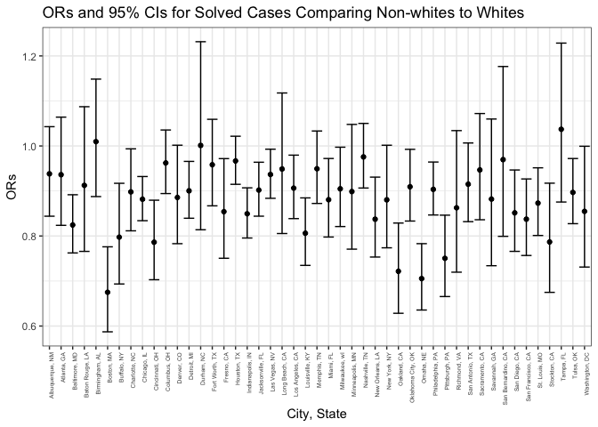
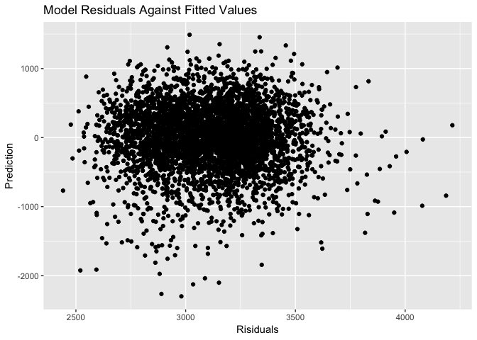

p8105\_hw6\_ak4123
================

Create a city\_state variable (e.g. “Baltimore, MD”), and a binary variable indicating whether the homicide is solved. Omit cities Dallas, TX; Phoenix, AZ; and Kansas City, MO – these don’t report victim race. Also omit Tulsa, AL – this is a data entry mistake.

``` r
homicides = read.csv("./data/homicide-data.csv")

homicides = homicides %>% 
  mutate(city_state = paste(city, state, sep = ", "),
         resolution = as.numeric(disposition == "Closed by arrest"),
         victim_race_binary = case_when(
           victim_race == "Asian" ~ "Non-White",
           victim_race == "Black" ~ "Non-White",
           victim_race == "Hispanic" ~ "Non-White",
           victim_race == "Other" ~ "Non-White",
           victim_race == "Unknown" ~ "Non-White",
           victim_race == "White" ~ "White"
         ),
         victim_race = factor(victim_race_binary, levels = c("White", "Non-White")),
         victim_age = as.numeric(as.character(victim_age))
  ) %>% 
  filter(city_state != "Dallas, TX" & city_state != "Phoenix, AZ" & city_state != "Kansas City, MO" & city_state != "Tulsa, AL")
```

    ## Warning in evalq(as.numeric(as.character(victim_age)), <environment>): NAs
    ## introduced by coercion

For the city of Baltimore, MD, use the glm function to fit a logistic regression with resolved vs unresolved as the outcome and victim age, sex and race (as just defined) as predictors. Save the output of glm as an R object; apply the broom::tidy to this object; and obtain the estimate and confidence interval of the adjusted odds ratio for solving homicides comparing non-white victims to white victims keeping all other variables fixed.

``` r
logistic = 
  homicides %>% 
  filter(city_state == "Baltimore, MD") %>% 
  glm(resolution ~ victim_age + victim_sex + victim_race, data = ., family = binomial())
logistic %>% 
  broom::tidy() %>% 
  janitor::clean_names() %>% 
  mutate(OR = exp(estimate),
         lower_ci = exp(estimate - (1.96 * std_error)),
         upper_ci = exp(estimate + (1.96 * std_error))) %>%
  filter(term == "victim_raceNon-White") %>% 
  select(OR, lower_ci, upper_ci) %>% 
  knitr::kable()
```

|        OR|  lower\_ci|  upper\_ci|
|---------:|----------:|----------:|
|  0.440608|  0.3129079|  0.6204234|

Now run glm for each of the cities in your dataset, and extract the adjusted odds ratio (and CI) for solving homicides comparing non-white victims to white victims. Do this within a “tidy” pipeline, making use of purrr::map, list columns, and unnest as necessary to create a dataframe with estimated ORs and CIs for each city.

``` r
logistic =
  homicides %>% 
  group_by(city_state) %>% 
  nest() %>% 
  mutate(models = map(data, ~lm(resolution ~ victim_age + victim_sex + victim_race, data = .x)),
         models = map(models, broom::tidy)) %>% 
  select(-data)

logistic = logistic %>% 
  unnest() %>% 
  janitor::clean_names() %>% 
  mutate(OR = exp(estimate),
         lower_ci = exp(estimate - (1.96 * std_error)),
         upper_ci = exp(estimate + (1.96 * std_error))) %>% 
  filter(term == "victim_raceNon-White") %>%
  select(city_state, OR, lower_ci, upper_ci) 
  
logistic %>% 
  knitr::kable()
```

| city\_state        |         OR|  lower\_ci|  upper\_ci|
|:-------------------|----------:|----------:|----------:|
| Albuquerque, NM    |  0.9381364|  0.8439611|  1.0428204|
| Atlanta, GA        |  0.9361747|  0.8236890|  1.0640217|
| Baltimore, MD      |  0.8244697|  0.7623590|  0.8916407|
| Baton Rouge, LA    |  0.9124647|  0.7658194|  1.0871910|
| Birmingham, AL     |  1.0096435|  0.8875775|  1.1484968|
| Boston, MA         |  0.6750011|  0.5871682|  0.7759727|
| Buffalo, NY        |  0.7974480|  0.6934397|  0.9170565|
| Charlotte, NC      |  0.8979433|  0.8115030|  0.9935911|
| Chicago, IL        |  0.8816895|  0.8339958|  0.9321106|
| Cincinnati, OH     |  0.7862386|  0.7028564|  0.8795127|
| Columbus, OH       |  0.9622876|  0.8942863|  1.0354597|
| Denver, CO         |  0.8855921|  0.7829507|  1.0016893|
| Detroit, MI        |  0.9003586|  0.8394328|  0.9657063|
| Durham, NC         |  1.0011652|  0.8138670|  1.2315672|
| Fort Worth, TX     |  0.9583003|  0.8670065|  1.0592071|
| Fresno, CA         |  0.8540912|  0.7505659|  0.9718956|
| Houston, TX        |  0.9667330|  0.9148169|  1.0215953|
| Indianapolis, IN   |  0.8494339|  0.7955435|  0.9069747|
| Jacksonville, FL   |  0.9019509|  0.8440237|  0.9638537|
| Las Vegas, NV      |  0.9366836|  0.8837253|  0.9928155|
| Long Beach, CA     |  0.9488369|  0.8054940|  1.1176886|
| Los Angeles, CA    |  0.9063814|  0.8386239|  0.9796135|
| Louisville, KY     |  0.8062044|  0.7347320|  0.8846294|
| Memphis, TN        |  0.9493614|  0.8722938|  1.0332379|
| Miami, FL          |  0.8806157|  0.7977046|  0.9721444|
| Milwaukee, wI      |  0.9048639|  0.8210219|  0.9972678|
| Minneapolis, MN    |  0.8987154|  0.7707936|  1.0478672|
| Nashville, TN      |  0.9757006|  0.9065794|  1.0500918|
| New Orleans, LA    |  0.8373291|  0.7532570|  0.9307847|
| New York, NY       |  0.8803584|  0.7737717|  1.0016274|
| Oakland, CA        |  0.7216275|  0.6283310|  0.8287769|
| Oklahoma City, OK  |  0.9093793|  0.8332201|  0.9924998|
| Omaha, NE          |  0.7054472|  0.6355823|  0.7829919|
| Philadelphia, PA   |  0.9035855|  0.8466800|  0.9643156|
| Pittsburgh, PA     |  0.7504633|  0.6654925|  0.8462832|
| Richmond, VA       |  0.8626584|  0.7196420|  1.0340969|
| San Antonio, TX    |  0.9150777|  0.8318636|  1.0066159|
| Sacramento, CA     |  0.9467486|  0.8361092|  1.0720285|
| Savannah, GA       |  0.8820030|  0.7340074|  1.0598386|
| San Bernardino, CA |  0.9696966|  0.7992488|  1.1764942|
| San Diego, CA      |  0.8514643|  0.7658733|  0.9466205|
| San Francisco, CA  |  0.8374086|  0.7567119|  0.9267109|
| St. Louis, MO      |  0.8730792|  0.8011558|  0.9514593|
| Stockton, CA       |  0.7867802|  0.6748170|  0.9173200|
| Tampa, FL          |  1.0370698|  0.8754783|  1.2284869|
| Tulsa, OK          |  0.8968168|  0.8273785|  0.9720828|
| Washington, DC     |  0.8547153|  0.7310151|  0.9993476|

``` r
nest_glm_res =
  homicides %>% 
  group_by(city_state) %>% 
  nest() %>% 
  mutate(models = map(data, ~lm(resolution ~ victim_age + victim_sex + victim_race, data = .x)),
         models = map(models, broom::tidy)) %>% 
  select(-data)

glm_homicides = nest_glm_res %>% 
  unnest() %>% 
  janitor::clean_names() %>% 
  mutate(OR = exp(estimate),
         lower_ci = exp(estimate - (1.96 * std_error)),
         upper_ci = exp(estimate + (1.96 * std_error))
  ) %>% 
  filter(term == "victim_raceNon-White") %>%
  select(city_state, OR, lower_ci, upper_ci) 
  
glm_homicides %>% 
  knitr::kable()
```

| city\_state        |         OR|  lower\_ci|  upper\_ci|
|:-------------------|----------:|----------:|----------:|
| Albuquerque, NM    |  0.9381364|  0.8439611|  1.0428204|
| Atlanta, GA        |  0.9361747|  0.8236890|  1.0640217|
| Baltimore, MD      |  0.8244697|  0.7623590|  0.8916407|
| Baton Rouge, LA    |  0.9124647|  0.7658194|  1.0871910|
| Birmingham, AL     |  1.0096435|  0.8875775|  1.1484968|
| Boston, MA         |  0.6750011|  0.5871682|  0.7759727|
| Buffalo, NY        |  0.7974480|  0.6934397|  0.9170565|
| Charlotte, NC      |  0.8979433|  0.8115030|  0.9935911|
| Chicago, IL        |  0.8816895|  0.8339958|  0.9321106|
| Cincinnati, OH     |  0.7862386|  0.7028564|  0.8795127|
| Columbus, OH       |  0.9622876|  0.8942863|  1.0354597|
| Denver, CO         |  0.8855921|  0.7829507|  1.0016893|
| Detroit, MI        |  0.9003586|  0.8394328|  0.9657063|
| Durham, NC         |  1.0011652|  0.8138670|  1.2315672|
| Fort Worth, TX     |  0.9583003|  0.8670065|  1.0592071|
| Fresno, CA         |  0.8540912|  0.7505659|  0.9718956|
| Houston, TX        |  0.9667330|  0.9148169|  1.0215953|
| Indianapolis, IN   |  0.8494339|  0.7955435|  0.9069747|
| Jacksonville, FL   |  0.9019509|  0.8440237|  0.9638537|
| Las Vegas, NV      |  0.9366836|  0.8837253|  0.9928155|
| Long Beach, CA     |  0.9488369|  0.8054940|  1.1176886|
| Los Angeles, CA    |  0.9063814|  0.8386239|  0.9796135|
| Louisville, KY     |  0.8062044|  0.7347320|  0.8846294|
| Memphis, TN        |  0.9493614|  0.8722938|  1.0332379|
| Miami, FL          |  0.8806157|  0.7977046|  0.9721444|
| Milwaukee, wI      |  0.9048639|  0.8210219|  0.9972678|
| Minneapolis, MN    |  0.8987154|  0.7707936|  1.0478672|
| Nashville, TN      |  0.9757006|  0.9065794|  1.0500918|
| New Orleans, LA    |  0.8373291|  0.7532570|  0.9307847|
| New York, NY       |  0.8803584|  0.7737717|  1.0016274|
| Oakland, CA        |  0.7216275|  0.6283310|  0.8287769|
| Oklahoma City, OK  |  0.9093793|  0.8332201|  0.9924998|
| Omaha, NE          |  0.7054472|  0.6355823|  0.7829919|
| Philadelphia, PA   |  0.9035855|  0.8466800|  0.9643156|
| Pittsburgh, PA     |  0.7504633|  0.6654925|  0.8462832|
| Richmond, VA       |  0.8626584|  0.7196420|  1.0340969|
| San Antonio, TX    |  0.9150777|  0.8318636|  1.0066159|
| Sacramento, CA     |  0.9467486|  0.8361092|  1.0720285|
| Savannah, GA       |  0.8820030|  0.7340074|  1.0598386|
| San Bernardino, CA |  0.9696966|  0.7992488|  1.1764942|
| San Diego, CA      |  0.8514643|  0.7658733|  0.9466205|
| San Francisco, CA  |  0.8374086|  0.7567119|  0.9267109|
| St. Louis, MO      |  0.8730792|  0.8011558|  0.9514593|
| Stockton, CA       |  0.7867802|  0.6748170|  0.9173200|
| Tampa, FL          |  1.0370698|  0.8754783|  1.2284869|
| Tulsa, OK          |  0.8968168|  0.8273785|  0.9720828|
| Washington, DC     |  0.8547153|  0.7310151|  0.9993476|

``` r
glm_homicides %>% 
  mutate(city_state = forcats::fct_inorder(city_state)) %>% 
  ggplot(aes(x = city_state, y = OR)) +
  geom_point() +
  geom_errorbar(aes(ymin = lower_ci, ymax = upper_ci)) +
  labs(
    x = "City, State",
    y = "ORs",
    title = "ORs and 95% CIs for Solved Cases Comparing Non-whites to Whites"
  ) +
  theme_bw() +
  theme(axis.text.x = element_text(angle = 90, hjust = 1, size = 5)) 
```



QUESTION 2
----------

Load and clean the data for regression analysis:

``` r
birthweight = read.csv("./data/birthweight.csv") %>% 
  mutate(
    babysex = case_when(
      babysex == 1 ~ "Male",
      babysex == 2 ~ "Female"),
    babysex = fct_relevel(babysex, "Male"),
    frace = case_when(
      frace == 1 ~ "White",
      frace == 2 ~ "Black",
      frace == 3 ~ "Asian",
      frace == 4 ~ "Puerto Rican",
      frace == 8 ~ "Other",
      frace == 9 ~ "Unknown"),
    frace = fct_relevel(frace, "White"),
    malform = case_when(
      malform == 0 ~ "Absent",
      malform == 1 ~ "Present"),
    malform = fct_relevel(malform, "Absent"),
    mrace = case_when(
      mrace == 1 ~ "White",
      mrace == 2 ~ "Black",
      mrace == 3 ~ "Asian",
      mrace == 4 ~ "Puerto Rican",
      mrace == 8 ~ "Other"),
    mrace = fct_relevel(mrace, "White")
  )
missing_data = sum(is.na(birthweight))
```

Propose a regression model for birthweight. Describe your modeling process and show a plot of model residuals against fitted values – use add\_predictions and add\_residuals in making this plot.

``` r
model_bwt = 
  lm(bwt ~ delwt+fincome+menarche+mheight+momage+mrace+ pnumlbw+pnumsga+ppbmi+ppwt, data = birthweight)
```

This model is based on maternal factors that could affect birthweight.

``` r
birthweight %>% 
  modelr::add_residuals(model_bwt) %>% 
  modelr::add_predictions(model_bwt) %>% 
  ggplot(aes(x = pred, y = resid)) +
    geom_point() +
  labs(
    x = "Risiduals",
    y = "Prediction",
    title = "Model Residuals Against Fitted Values")
```

    ## Warning in predict.lm(model, data): prediction from a rank-deficient fit
    ## may be misleading

    ## Warning in predict.lm(model, data): prediction from a rank-deficient fit
    ## may be misleading


